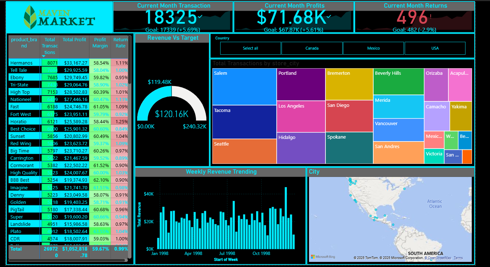

# Maven Market Dashboard – Power BI

This project is a complete business intelligence case study built using data from *Maven Market*, a fictional multinational grocery chain with locations in Canada, Mexico, and the United States.

---

## 📌 Objective

To simulate real-world data analytics tasks by transforming raw sales and customer data into actionable insights through Power BI dashboards.

---

## 📊 Project Highlights

- Connected and shaped raw Excel datasets using *Power Query*
- Built a *relational star schema model* with fact and dimension tables
- Created *DAX measures* for key performance indicators (KPIs), such as sales by region, product category performance
- Developed an *interactive Power BI report* with slicers, filters, and tooltips
- Analyzed data across *3 regions*, identifying patterns and business insights

---

## 🛠 Tools & Techniques

- Microsoft Power BI  
- Power Query  
- Data Modeling (Star Schema)  
- DAX (Data Analysis Expressions)  
- Excel  
- Data Visualization

---

## 📂 File Structure

- MavenMarket.pbix: Power BI report file
- `Maven Market CSV Files.zip `: Contains raw Excel files used in the project

---

## 📸 Topline Performance Dashboard

---

## 🔗 Project Outcomes

- Demonstrated ability to clean, model, and visualize large datasets
- Simulated end-to-end BI workflow from raw data to executive-level reporting
- Developed insights to support data-driven decision-making in retail operations

---
